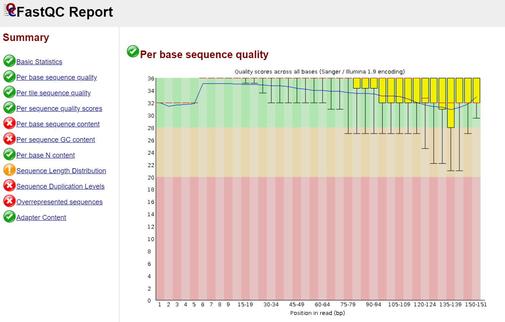

# MIP 280A4 Final Project 2022
This report is catorgerizing and identifiying virus sequences from a female Aedes aegypti originially from Guerrero, Mexico. This mosquito was taken from the colony at the center for vector-borne infectious diseases (CVID). I will use the thoth01 server through linux to help clean up and assemble my sequenced data. The cleaned up data will be analyzed with genius, NCBI blast, and fastqc. 
it is written in [markdown format](https://www.markdownguide.org/basic-syntax/).
## step 1: copying the file to a new directory
To perform this command we need to make sure we are in the correct working directory a good way to check this is by running the ```pwd``` command. We also need to know that the file we want to copy is in our directory, a good comman for this is ```ls -lrth```. Now you can run the command below to move it into your new directory.
```
(bio_tools) twolbers@thoth01:/home/data_for_classes/2022_MIP_280A4/final_project_datasets$ cp Aedes_Guerrero_R1.fastq ~/final_project
```
## step 2: Quality check of seqeunce using [fastqc]
The next steps in linux requires you to use commands that are not in your ```PATH```, to use these commands we need to enter the conda enviornment. The ```conda``` enviornment will put the appropriate directory in your ```PATH``` allowing you to run commands like [fastqc], [cutadapt], [spades], and many more that are not used in this project. run the command below to enter your ```conda``` enviornment.
```
(base) twolbers@thoth01:~/final_project$ conda activate bio_tools
```
The libraries were sequenced using a illumina next gen sequencer to produce single end sequences that are 150 base reads long. The illumina next gen sequencer can produce low quality reads and sometimes sequences your adapters, because of this we will have to check the quality of the reads before anything else. 
```
(bio_tools) twolbers@thoth01:~/final_project$ fastqc Aedes_Guerrero_R1.fastq
```


The illumina sequencing data is roughly 1.5 million reads long. The lowest quality score is 16, but the average is about 34. The graphs show that the quality of the reads are low near the end of the reads. The second graph specifically shows that these low reads are coming from adaters well need to trim these reads to get rid of adapters and low quality reads.
## step 3: Trim addapters and low quality reads using [cutadapt]
After checking the quality reports of or illumina sequencing data we will need to trim the low quality reads with the command below.
```
(bio_tools) twolbers@thoth01:~/final_project$ cutadapt \
-a AGATCGGAAGAGC \
-g GCTCTTCCGATCT \
-a AGATGTGTATAAGAGACAG \
-g CTGTCTCTTATACACATCT \
-q 30,30 \
--minimum-length 80 \
-o Aedes_Guerrero_trimmed1 \
Aedes_Guerrero_R1.fastq \
| tee cutadapt.log
```
## step 4: Check quality of trimmed reads using [fastqc]
```
(bio_tools) twolbers@thoth01:~/final_project$ fastqc Aedes_Guerrero_trimmed1
```



The quality report on the trimmed reads above shows that the [cutadapt] trim command took care of the reads that had a quality score of 16. The second graph shows that there are no more adapter reads that would have ultimately not mapped correctly.
## step 5: find and download host genome in fasta format
We are going to need to seperate the reads from our msoguitos from the reads that could possibly be a virus. Open the NCBI website, find Aedes aegypti genome, copy the url and run the command below. Note: it is important to make sure you are in the directory that your trimmed sequence is in.
```
(base) twolbers@thoth01:~/final_project$ curl -OL \ https://ftp.ncbi.nlm.nih.gov/genomes/all/GCF/002/204/515/GCF_002204515.2_AaegL5.0/GCF_002204515.2_AaegL5.0_genomic.fna.gz
```
## step 6: Create an index for our Aedes aegypti seqeunce from NCBI using [bowtie2-build] 
```
(bio_tools) twolbers@thoth01:~/final_project$ nohup bowtie2-build \
GCF_002204515.2_AaegL5.0_genomic.fna.gz index
```
## step 7: map trimmed reads to host index and save non-mapped reads
The goal was to take out all of the Aedes agypti sequences so we can assemble just the reads that arent part of the mosquitoe. below is the command that we ran.
```
bowtie2 -x  \ index
   -U Aedes_Guerrero_trimmed1 \
   --un \
   --threads 20 \
   -S Aedes_Guerrero_not_mapped_to_mosq_index.fastq 
(bio_tools) twolbers@thoth01:~/final_project$ rm Aedes_Guerrero_not_mapped_to_mosq_index.2.fastq
```
## step 8: Assemble non-mapped reads using [spades]
The non-assembled reads will be turned into different contigs that will assemble to make a sequence that should have the virus sequence that the mosquito is carrying. Below is the command we ran to assemble the sequence.
```
(bio_tools) twolbers@thoth01:~/final_project$ spades.py \
-o Aedes_Guerrero_spades_assembly \
-1 Aedes_Guerrero_not_mapped_to_mosq_index.fastq \
-m 24 -t 18 
```
## step 9: run a blast search on first 12 contigs using NCBI
Using cyber duck get 

