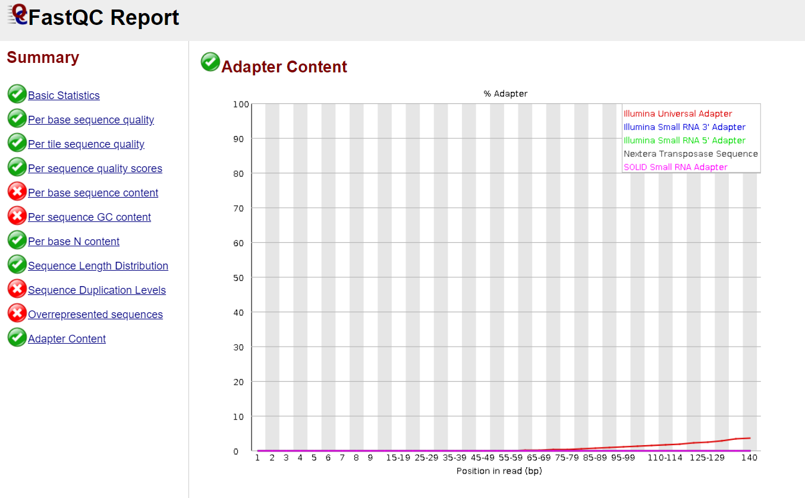

# MIP 280A4 Final Project 2022
This report will provide a step by step walk through on my project for MIP 280A4. catorgerizing and identifiying virus sequences from a pool of female Aedes aegypti. the original mosquito was taken from Guerrero, Mexico. The mosquito pool that were sequenced for this project are from a colony at the center for vector-borne infectious diseases (CVID). I will use the thoth01 server through linux to help clean up and assemble my sequenced data. With the goal of finding viral sequence to determine what viruses this mosquito is carrying. The cleaned up data will be analyzed with genius, and [NCBI](https://www.ncbi.nlm.nih.gov/). 
it is written in [markdown format](https://www.markdownguide.org/basic-syntax/).
## Virus Hunting with Aedes aegypti from Guerreo, Mexico


## step 1: copying the file to a new directory
To perform this command we need to make sure we are in the correct working directory a good way to check this is by running the ```pwd``` command. We also need to know that the file we want to copy is in our directory, a good comman for this is ```ls -lrth```. Now you can run the command below to move it into your new directory.
```
(bio_tools) twolbers@thoth01:/home/data_for_classes/2022_MIP_280A4/final_project_datasets$ cp Aedes_Guerrero_R1.fastq ~/final_project
```
## step 2: Quality check of seqeunce using [fastqc]
The next steps in linux requires you to use commands that are not in your ```PATH```, to use these commands we need to enter the conda enviornment. The ```conda``` enviornment will put the appropriate directory in your ```PATH``` allowing you to run commands like [fastqc], [cutadapt], [spades], and many more that are not used in this project. run the command below to enter your ```conda``` enviornment.
```
(base) twolbers@thoth01:~/final_project$ conda activate bio_tools
```
The libraries were sequenced using a illumina next gen sequencer to produce single end sequences that are 150 base reads long. The illumina next gen sequencer can produce low quality reads and sometimes sequences your adapters, because of this we will have to check the quality of the reads before anything else. 
```
(bio_tools) twolbers@thoth01:~/final_project$ fastqc Aedes_Guerrero_R1.fastq
```




The illumina sequencing data is roughly 1.5 million reads long. The lowest quality score is 16, but the average is about 34. The graphs show that the quality of the reads are low near the end of the reads. The second graph specifically shows that these low reads are coming from adaters will need to be trimed to get rid of adapters and low quality reads.
## step 3: Trim addapters and low quality reads using [cutadapt]
After checking the quality reports of or illumina sequencing data we will need to trim the low quality reads with the command below.
```
(bio_tools) twolbers@thoth01:~/final_project$ cutadapt \
-a AGATCGGAAGAGC \
-g GCTCTTCCGATCT \
-a AGATGTGTATAAGAGACAG \
-g CTGTCTCTTATACACATCT \
-q 30,30 \
--minimum-length 80 \
-o Aedes_Guerrero_trimmed1 \
Aedes_Guerrero_R1.fastq \
| tee cutadapt.log
```
## step 4: Check quality of trimmed reads using [fastqc]
```
(bio_tools) twolbers@thoth01:~/final_project$ fastqc Aedes_Guerrero_trimmed1
```


The quality report on the trimmed reads above shows that the [cutadapt] trim command took care of the reads that had a quality score of 16. The second graph shows that there are no more adapter read. These reads were taken out, because they would have ultimately not mapped correctly.
## step 5: find and download host genome in fasta format
We are going to need to seperate the reads that are from our mosquitos. Open the NCBI website, find Aedes aegypti genome, copy the [url](https://www.ncbi.nlm.nih.gov/data-hub/genome/GCF_002204515.2/) and run the command below. Note: it is important to make sure you are in the directory that your trimmed sequence is in.
```
(base) twolbers@thoth01:~/final_project$ curl -OL \ https://ftp.ncbi.nlm.nih.gov/genomes/all/GCF/002/204/515/GCF_002204515.2_AaegL5.0/GCF_002204515.2_AaegL5.0_genomic.fna.gz
```
## step 6: Create an index for our Aedes aegypti seqeunce from NCBI using [bowtie2-build] 
complete genome sequences are often very large, to make it easier for the server we will create an index. The index will essentially be cut up pieces of the genome for when we go to map our trimmed reads. creating the index can take some time for the server, the ```nohup``` command will allow for the server to continue the task while you are logged off. Run the command below to make an index of the Aedes aegypti complete genome.
```
(bio_tools) twolbers@thoth01:~/final_project$ nohup bowtie2-build \
GCF_002204515.2_AaegL5.0_genomic.fna.gz index
```
## step 7: map trimmed reads to host index and save non-mapped reads
Mapping requires two sequences your mapping input, in this case the trimmed data set, and a reference sequence, the Aedes aegypti complete genome. The input sequence will map to the refrence sequence, mapping can be used for a few things, quantification, variant identification, and removing known sequences we do not want to asseble. We will be using it to get rid of any reads that map to the Aedes aegypti, because we want to find the virus sequence. below is the command ran to map the reads to the Aedes aegypti index, because we want to see the unmapped reads we will use the command ```--un``` and then save those reads.
```
bowtie2 -x  \ index
   -U Aedes_Guerrero_trimmed1 \
   --un \
   --threads 20 \
   -S Aedes_Guerrero_not_mapped_to_mosq_index.fastq 
(bio_tools) twolbers@thoth01:~/final_project$ rm Aedes_Guerrero_not_mapped_to_mosq_index.2.fastq
```
## step 8: Assemble non-mapped reads using [spades]
The non-assembled reads will be turned into different contigs that will assemble to make a sequence that should have all sequences that are not from the mosquito, but were extracted from the mosquito pool. The contigs should be virus and bacteria sequences that were in the mosquito pool. Below is the command we ran to assemble the sequence.
```
(bio_tools) twolbers@thoth01:~/final_project$ spades.py \
-o Aedes_Guerrero_spades_assembly \
-1 Aedes_Guerrero_not_mapped_to_mosq_index.fastq \
-m 24 -t 18 
```
## save only the 12 largest contigs
To analyze only the 12 largest contigs of the unmapped reads, I ran the command below. 
seqtk seq -A contigs.fasta  |head -24 >first_12_contigs.fasta
The command is a very common command, in this case it is known that contigs are 2 lines each so if we wanted the 8 largest contigs we would run the same command but instead of ```head -24``` we would use ```head -16```
## step 9: run a blast search on first 12 contigs using NCBI
Using cyber duck transfer the file from the server to your downloads.
1. Open cyber duck and ssh into the server.
2. Open the directory final_project.
3. Access your file named first_12_contigs.fasta and download to downloads.
4. Open [NCBI, BLAST](https://blast.ncbi.nlm.nih.gov/Blast.cgi?PROGRAM=blastn&PAGE_TYPE=BlastSearch&LINK_LOC=blasthome)
5. Select choose file and use the first_12_contigs.fasta file keep defualt settngs screen should look like this.


